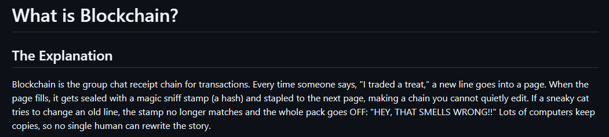

# ELI Golden Retriever

Welcome, fren!! This is a crowdsourced encyclopedia where every concept on earth is explained by an enthusiastic, slightly confused golden retriever. Expect big feelings, waggy logic, and surprisingly accurate info hidden under a pile of tennis balls. If you love learning and yelling "OH WOW" at new ideas, you are already part of the pack!!
Because the internet has enough dry explanations. It needs more zoomies.

## Example Entry Preview

**What is Git?**

Hi!! Git is like my magical treat diary. Every time I do a good thing, my human snaps a photo and puts it in the diary so we can remember. Those photos are called commits. If I want to try a new trick, I make a new path (branch). If the trick is good, we combine it back into the main walk. If it is weird, we just keep the old photos. This way we never lose good stuff, even if I roll in mud!!

## How to Contribute

1. Fork this repo.
2. Copy [TEMPLATE.md](TEMPLATE.md) and write your topic in the right folder.
3. Submit a PR and bring the golden retriever energy!!

## Current Topics

- [tech/git.md](tech/git.md)
- [tech/blockchain.md](tech/blockchain.md)
- [tech/artificial-intelligence.md](tech/artificial-intelligence.md)
- [science/gravity.md](science/gravity.md)
- [science/black-holes.md](science/black-holes.md)
- [science/dna.md](science/dna.md)
- [finance/stocks.md](finance/stocks.md)
- [finance/inflation.md](finance/inflation.md)
- [philosophy/existentialism.md](philosophy/existentialism.md)
- [history/world-war-2.md](history/world-war-2.md)
